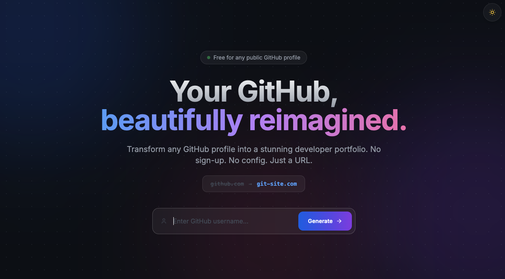

# Git-Site.com - Beautiful GitHub Profile Visualizer

Transform any GitHub profile into a stunning visual portfolio with intelligent analysis and beautiful visualizations. Just replace `github.com` with `git-site.com` in any profile URL.


## 🌐 Live Preview

**Check it out in action:**
- **[my Profile](https://git-site.com/edensitko)** - Live demo of the visualizer
- Visit any GitHub profile at: `https://git-site.com/<github-username>`

[](https://git-site.com)

<a href="https://git-site.com"></a>

## ✨ Features

### 🎨 Beautiful Visualizations
- **Tech Stack Carousel**: Animated showcase of 200+ technologies and frameworks with icon detection
- **Language Distribution**: Interactive toggle between pie and bar charts showing language usage percentages
- **Smart Categories**: Repositories automatically grouped by type (CLI Tools, Web Apps, Libraries, etc.)
- **Activity Timeline**: Recent commits, PRs, and contributions in a clean, chronological timeline

### 📊 Comprehensive Analytics
- **Repository Insights**: Total stars, forks, and activity metrics across all repositories
- **Top Repositories**: Showcase most starred and forked projects with detailed stats
- **Account Insights**: Detailed profile statistics, trends, and contribution patterns
- **Organization Display**: Show all organizations and memberships with logos

### 🤖 Intelligent Features
- **Developer Summary**: Automated analysis of coding style, expertise, and patterns
- **Skills Detection**: Automatic detection of 200+ technologies from repositories
- **Project Categorization**: Smart grouping based on repo content, topics, and languages

### 🎯 User Experience
- **Dark Mode**: Beautiful dark theme with smooth transitions and system preference detection
- **Fully Responsive**: Perfect experience on mobile (< 640px), tablet (640-1024px), and desktop (> 1024px)
- **No Signup Required**: Works instantly with any public GitHub profile
- **Fast & Lightweight**: Optimized performance with Next.js 14 and server-side rendering
- **SEO Optimized**: Metadata includes keywords, canonical links, Open Graph, Twitter cards, geo tags, and JSON-LD schema
- **Robots.txt & Sitemap**: Public directory contains a robots.txt with sitemap reference
- **Performance & Accessibility**: Fast static rendering and responsive design help search rankings
- **ESLint during builds**: Lint checks are ignored in production builds (configured in `next.config.mjs`), run `npm run lint` locally or in CI
- **Network Access**: Run on local network for testing on multiple devices

## 🚀 Quick Start

### 🔗 Custom Domain (GitHub Pages)

To point a domain at the GitHub Pages deployment:

1. Add a file `public/CNAME` containing your domain (`example.com` or `www.example.com`).
2. Commit & push; the CI export step will include it in the generated site.
3. In your domain registrar, create a CNAME record pointing your host to `edensitko.github.io` (or an A record pointing to GitHub Pages IPs for apex domains).
4. Visit the GitHub repository **Settings → Pages** and enter your custom domain; GitHub will provision HTTPS automatically.

> ⚠️ Remember to update the `metadata.openGraph.url` in `app/layout.tsx` when your site moves.


### Prerequisites
- Node.js 18+ installed
- npm or yarn package manager
- GitHub Personal Access Token (optional but recommended for higher rate limits)

### Installation

1. Clone the repository:
```bash
git clone https://github.com/yourusername/git-site.git
cd git-site
```

2. Install dependencies:
```bash
npm install
```

3. Create a `.env.local` file in the root directory:
```bash
APP_TOKEN=your_github_personal_access_token
```

**To get a GitHub token:**
- Go to GitHub Settings → Developer settings → Personal access tokens → Tokens (classic)
- Click "Generate new token (classic)"
- Select scopes: `public_repo` and `read:user`
- Copy the token and paste it into `.env.local`

4. Run the development server:
```bash
npm run dev
```

5. Open [http://localhost:3000](http://localhost:3000) in your browser

### Network Access (Optional)

To access from other devices on your network:
```bash
npm run dev
```

The app will be available at:
- **Local**: `http://localhost:3000`
- **Network**: `http://YOUR_LOCAL_IP:3000` (e.g., `http://10.0.0.4:3000`)

## 🔧 Usage

### Basic Usage
Simply replace `github.com` with `git-site.com` in any GitHub profile URL:

```
github.com/torvalds  →  git-site.com/torvalds
github.com/vercel    →  git-site.com/vercel
github.com/gaearon   →  git-site.com/gaearon
```

### Direct Access
Type the URL directly in your browser:
```
https://git-site.com/username
```

### Search
Use the search box on the homepage to enter any GitHub username and generate their portfolio instantly.

### Example URLs to Try
- `http://localhost:3000/torvalds` - Linus Torvalds
- `http://localhost:3000/vercel` - Vercel
- `http://localhost:3000/facebook` - Facebook
- `http://localhost:3000/microsoft` - Microsoft

## 🏗️ Tech Stack

### Frontend
- **Next.js 14.2** - React framework with App Router and Server Components
- **React 18.3** - UI library with hooks and modern patterns
- **TypeScript 5.0** - Type safety and better developer experience
- **Tailwind CSS 3.4** - Utility-first CSS framework with custom animations

### Features & Libraries
- **GitHub REST API v3** - Fetch user and repository data in real-time
- **Server Components** - Optimized data fetching and rendering
- **Image Optimization** - Next.js Image component with WebP conversion
- **Dark Mode** - Theme switching with localStorage persistence
- **Responsive Design** - Mobile-first approach with breakpoints

### Development Tools
- **ESLint** - Code linting and quality checks
- **PostCSS** - CSS processing and optimization
- **Autoprefixer** - Automatic CSS vendor prefixes

## 📁 Project Structure

```
git-site/
├── app/                      # Next.js App Router
│   ├── [username]/          # Dynamic user profile pages
│   │   ├── page.tsx         # Profile page component (SSR)
│   │   └── not-found.tsx    # 404 page for invalid users
│   ├── layout.tsx           # Root layout with theme provider
│   ├── page.tsx             # Landing page with search
│   └── globals.css          # Global styles and animations
├── components/              # React components
│   ├── ProfileHeader.tsx    # User profile header with avatar
│   ├── StatsBar.tsx         # Statistics display (4 in 1 row)
│   ├── LanguageChart.tsx    # Language distribution (bar/pie toggle)
│   ├── TechStackCarousel.tsx # Tech stack showcase (200+ icons)
│   ├── RecentActivity.tsx   # Activity timeline
│   ├── TopRepos.tsx         # Top repositories by stars
│   ├── ProjectsByCategory.tsx # Categorized repositories
│   ├── AIDeveloperSummary.tsx # Developer insights component
│   ├── AccountInsights.tsx  # Account analysis
│   ├── SkillsDetected.tsx   # Detected skills from repos
│   ├── Organizations.tsx    # User organizations
│   ├── RepoCard.tsx         # Repository card component
│   └── ThemeToggle.tsx      # Dark/light mode toggle
├── lib/                     # Utility functions and logic
│   ├── github.ts            # GitHub API client functions
│   ├── analyzer.ts          # Skills and tech detection
│   ├── categorizer.ts       # Repository categorization logic
│   ├── ai-summary.ts        # Developer summary generation (rule-based)
│   ├── stats.ts             # Statistics calculations
│   ├── types.ts             # TypeScript type definitions
│   └── tech-icons.json      # 200+ technology icons database
├── public/                  # Static assets
├── .github/workflows/       # CI/CD pipelines
│   └── ci-cd.yml           # Docker build and GitHub Pages deploy
├── Dockerfile              # Multi-stage Docker configuration
├── .dockerignore           # Docker build exclusions
├── next.config.mjs         # Next.js configuration
├── tailwind.config.ts      # Tailwind CSS configuration
└── package.json            # Dependencies and scripts
```

## 🎨 Key Components

### ProfileHeader
Displays user's avatar, name, username, bio, and location with a beautiful gradient background.

**Features**: Optimized images, responsive layout, social links

### StatsBar
Shows 4 key metrics in one row: Public Repos, Followers, Following, Total Stars.

**Layout**: `grid-cols-4` for consistent single-row display on all screen sizes

### LanguageChart
Interactive chart with toggle between pie and bar views showing language distribution.

**Features**: Client-side state management, color-coded languages, percentage calculations

### TechStackCarousel
Animated horizontal carousel displaying 200+ detected technologies with icons.

**Detection**: Languages, topics, package files, configuration files

**Animation**: Infinite scroll with seamless loop

### ProjectsByCategory
Smart categorization of repositories into 10+ categories.

**Categories**: CLI Tools, Web Apps, Libraries, Bots, Mobile Apps, Games, Documentation, etc.

### AIDeveloperSummary
Automated summary analyzing coding style, expertise areas, and project focus using rule-based analysis.

**Analysis**: Language patterns, repository types, contribution frequency, technology diversity

### RecentActivity
Timeline of recent commits and repository updates with timestamps.

**Events**: Commits, PRs, issues, forks, stars, and more

## 🔑 Environment Variables

Create a `.env.local` file in the root directory:

```env
# GitHub Personal Access Token (optional but recommended)
# Increases API rate limit from 60 to 5000 requests/hour
APP_TOKEN=your_github_token_here
```

**Why use a token?**
- Without token: 60 requests/hour per IP
- With token: 5000 requests/hour
- Required for private repositories (if needed in future)

**Important**: If you have a system environment variable `GITHUB_TOKEN`, it will override `.env.local`. Either unset it or export the correct value.

## 🐳 Docker Deployment

### Build and run with Docker:
```bash
# Build the image
docker build -t git-site .

# Run the container
docker run -p 3000:3000 -e GITHUB_TOKEN=your_token_here git-site
```

### Pull from Docker Hub:
```bash
docker pull yourusername/git-site:latest
docker run -p 3000:3000 -e GITHUB_TOKEN=your_token_here yourusername/git-site:latest
```

### Multi-stage Build
The Dockerfile uses a multi-stage build for optimization:
- **Builder stage**: Installs dependencies and builds the app
- **Runner stage**: Minimal production image with only necessary files

## 🚀 Deployment

### Vercel (Recommended)
[](https://vercel.com/new/clone?repository-url=https://github.com/yourusername/git-site)

1. Push your code to GitHub
2. Import your repository in Vercel
3. Add `GITHUB_TOKEN` environment variable in Vercel settings
4. Deploy!

Your app will be available at `your-app.vercel.app` or custom domain `git-site.com`

### Docker Hub
The CI/CD pipeline automatically:
- Builds Docker image on every push to main
- Pushes to Docker Hub with tags: `latest`, `{git-sha}`, `{branch-name}`
- Multi-stage build for optimized image size

### GitHub Pages
For static export:
```bash
npm run export
```

The `out` directory can be deployed to GitHub Pages. The CI/CD pipeline automatically deploys to GitHub Pages on every push to main branch.

See [CI-CD-SETUP.md](./CI-CD-SETUP.md) for detailed configuration instructions.

## 📜 Available Scripts

```bash
npm run dev      # Start development server with network access (-H 0.0.0.0)
npm run build    # Create production build
npm start        # Run production server
npm run export   # Export static site for GitHub Pages
npm run lint     # Run ESLint (if configured)
```

## 🎯 Features in Detail

### Responsive Design
- **Mobile** (< 640px): Single column layout, touch-optimized
- **Tablet** (640-1024px): Two column grid, balanced layout
- **Desktop** (> 1024px): Three column grid, full features

### Dark Mode
- System preference detection on initial load
- Manual toggle with persistent localStorage
- Smooth transitions between themes
- Optimized colors for both light and dark modes

### Tech Stack Detection
Automatically detects technologies from:
- Repository languages (from GitHub API)
- Repository topics and tags
- Package files (package.json, requirements.txt, Gemfile, etc.)
- Configuration files (Dockerfile, kubernetes, terraform, etc.)

### Repository Categorization
Smart grouping based on:
- Repository name patterns
- Description keywords
- Topics and tags
- Primary language
- File structure

## 🔧 CI/CD Pipeline

**File**: `.github/workflows/ci-cd.yml`

### Jobs

1. **Build & Push Docker**
   - Builds multi-stage Docker image
   - Pushes to Docker Hub with multiple tags
   - Runs on every push to main branch

2. **Deploy to GitHub Pages**
   - Exports static Next.js site
   - Deploys to `gh-pages` branch
   - Accessible at `username.github.io/git-site`

### Required Secrets
- `DOCKERHUB_USERNAME` - Your Docker Hub username
- `DOCKERHUB_TOKEN` - Your Docker Hub access token

See [CI-CD-SETUP.md](./CI-CD-SETUP.md) for setup instructions.

## 🐛 Troubleshooting

### GitHub API 401 Error
- Check your `.env.local` file exists and has correct token
- Verify token has `public_repo` and `read:user` scopes
- Check if system environment variable is overriding `.env.local`
- Solution: `unset GITHUB_TOKEN` or `export GITHUB_TOKEN=your_token`

### Build Errors
- Run `npm install` to ensure all dependencies are installed
- Clear `.next` folder: `rm -rf .next`
- Rebuild: `npm run build`
- Check Node.js version (requires 18+)

### Network Access Not Working
- Ensure dev script uses `-H 0.0.0.0` flag (already configured)
- Check your local IP address: `ifconfig` (macOS/Linux) or `ipconfig` (Windows)
- Verify firewall settings allow connections on port 3000
- Try accessing from another device: `http://YOUR_LOCAL_IP:3000`

### Rate Limiting
- Without token: 60 requests/hour
- With token: 5000 requests/hour
- Check rate limit status: `curl -H "Authorization: token YOUR_TOKEN" https://api.github.com/rate_limit`

## 🤝 Contributing

Contributions are welcome! Please feel free to submit a Pull Request.

1. Fork the repository
2. Create your feature branch (`git checkout -b feature/AmazingFeature`)
3. Commit your changes (`git commit -m 'Add some AmazingFeature'`)
4. Push to the branch (`git push origin feature/AmazingFeature`)
5. Open a Pull Request

### Development Guidelines
- Follow TypeScript best practices
- Use Tailwind CSS for styling
- Ensure responsive design on all screen sizes
- Test with multiple GitHub profiles
- Update documentation for new features

## 📝 License

This project is open source and available under the [MIT License](LICENSE).

## 🙏 Acknowledgments

- [GitHub API](https://docs.github.com/en/rest) - For providing comprehensive developer data
- [Devicon](https://devicon.dev/) - For technology icons and logos
- [Next.js](https://nextjs.org/) - For the amazing React framework
- [Tailwind CSS](https://tailwindcss.com/) - For the utility-first CSS approach
- [Vercel](https://vercel.com/) - For seamless deployment platform

## 📚 Documentation

- [README.md](./README.md) - This file
- [QUICKSTART.md](./QUICKSTART.md) - Quick start guide
- [HOW-IT-WORKS.md](./HOW-IT-WORKS.md) - Technical architecture and implementation details
- [CI-CD-SETUP.md](./CI-CD-SETUP.md) - CI/CD pipeline configuration
- [DEPLOYMENT.md](./DEPLOYMENT.md) - Deployment guides for various platforms
- [TEST.md](./TEST.md) - Testing instructions and examples

## 📧 Contact

- GitHub: [@yourusername](https://github.com/yourusername)
- Website: [git-site.com](https://git-site.com)

## 🌟 Show Your Support

Give a ⭐️ if this project helped you!

## 💡 Use Cases

- **Personal Portfolio**: Showcase your GitHub profile professionally
- **Job Applications**: Share a beautiful portfolio with potential employers
- **Team Profiles**: Display organization members' contributions
- **Open Source Projects**: Highlight maintainers and contributors
- **Developer Communities**: Discover and explore developer profiles

---

Made with ❤️ by developers, for developers | [git-site.com](https://git-site.com)
